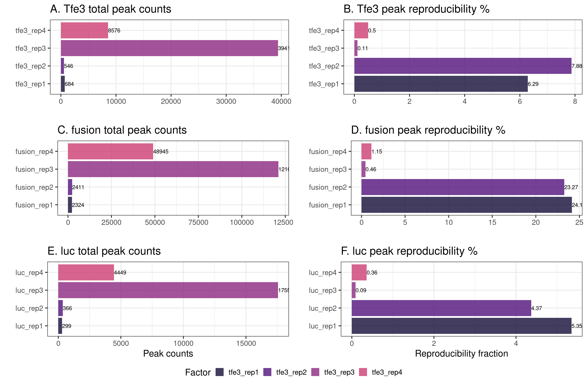

# Author:
Nhung Pham, 14-03-2023

# Data description

# Set up
All scripts were run on HPC with slurm in a conda environment. A similar environment can be created from environment.yaml. The file is arranged to have trim_galore installed before other packages to prevent version conflict. 

```
conda env create -f environment.yaml
```
# Scripts and running time overview

The cut and run data were analyzed based on published protocol with modification [add ref]. The running time was calculated with the current setup in the master_script.sh. 

|Steps | Run time (with current set up, 16 threads, parallel)| Script name|
|------|-----------------|------------|
|1. Quality checking | ~ 30 mins (1 sample) | 1-qualityCheck.sh |
|2. Trimming|  ~40 mins (1 sample) |2-trimming.sh |
|3. Alignment|  ~ 30 mins - 2 hours (1 sample), 8 hours (18 samples) | 3-alignment.sh |
|4. Remove duplicate | ~ 20 mins (1 sample) | 4-filtering.sh |
|5. Call peak|  ~ 1 hour (18 samples) | 5-peakCalling.sh |
|6. Peak analysis| | 6-DiffBind.R  |
|7. Peak annotation | | | |
|8. Transform bam file to bigwig | | ~ 2-3 hours |8-bam2bigwig.sh|
|9. Heatmap generation| ~30 minutes |9-heatmap.sh |
|10. Prepare for motif finding|  a few seconds |10-prepareMotifAnalysis.sh |
|11. Find motif | | | |
|12. Analyze motif | | | | 

# Steps description

Report ideas were adapted from https://nf-co.re/cutandrun/dev/output#4--alignment-post-processing [https://github.com/nf-core/cutandrun]
## Initial data quality checking: sequence reads, duplication rate, trimming, replicate correlation 

## 1. Quality checking: check reads quality with fastQC

FastQC read count

## 2. Trimming: remove adapter and conduct fastQC after with trim_galore

Sequence quality before and after trimming


## 3. Alignment: map reads to human genome g38
### 3.1. alignment 

Tool: bowtie2, reference genome: hg38
Alignment 


## 4. Remove duplicate: remove duplicate and reads < 20bp 


<p>
    
</p>
<p>
    <em>Replicate correlation: overall most replicates from the same condition are highly correlated indicate that data from replicate are reliable.</em>
</p>


## Peak calling and downstream analysis 
## 5. Call peak: broad and narrow peak calling with and without control

## 6. Peak analysis: identify differential binding peaks between groups
H3k4me3 samples


Tfe3, luc and fusion samples


## 7. Peak annotation
## 8. Transform bam file to bigwig: merge bam files of the same condition and convert to bigwig to use for heatmap generation
## 9. Heatmap generation: Generate heatmap for peaks
## 10. Prepare for motif finding: merge narrow peak files from the same condition and extract the fasta sequence for STREME meme suit
## 11. Find motif 
## 12. Analyze motif 
